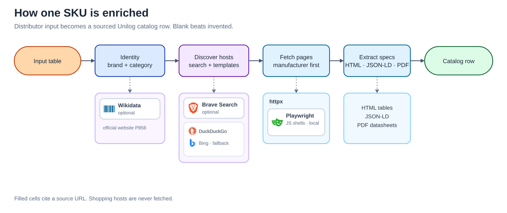
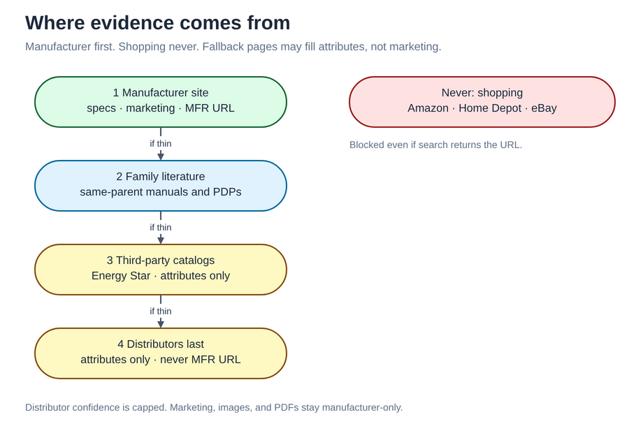

# unilog

[Live app](https://unilog-tau.vercel.app) · [3-min demo](https://vimeo.com/1220615209) · Deck: `submission/UniHack_thExplorers_Prototype.pptx`

We turn a distributor input table (`Mfg_Part_Num`, `Part_Desc`, `E1_Brand`, `Unilog_Brand`, `DIB_Brand`, `Part_Manuf`) into a Unilog catalog row. Manufacturer pages first. Shopping hosts never. Every filled cell cites a source.

Delivery we already ran: `output/batch_enriched.csv`, `output/batch_enriched.xlsx`, `output/field_provenance.json`.

## How it works

<p align="center">
  
</p>

<p align="center">
  
</p>

Figure sources: `docs/diagrams/*.svg` and `docs/diagrams/*.excalidraw`.

```
ingest → identity → classify → fetch → extract → normalize → compose → validate
```

`enrich_input_row` in `pipeline.py` is the one entry both the app and `cli.py batch` call. We do not replay a precooked delivery CSV when you paste input.

## Results

| Metric | Result |
|---|---|
| Reference SKUs vs organizer expected output | 134/134 fields on `PDSH4816AF` and `WDTS7024RZ` |
| Rows classified | 1000 / 1000 |
| Avg filled fields (live 1000-row batch) | 54.35 |
| Confidence (live batch) | 460 high · 520 medium · 20 review |
| Tests | hermetic, network off unless a test opts in |

High confidence needs an external manufacturer URL. `input:Part_Desc` cannot be high. Blank beats invented.

## Quick start

```bash
python3 -m venv .venv && source .venv/bin/activate
pip install -r requirements.txt

PYTHONPATH=. python3 cli.py reference       # two gold SKUs, no network
PYTHONPATH=. pytest -q
PYTHONPATH=. python3 cli.py batch --filter all --xlsx --workers 4
# Same command resumes from the checkpoint. --fresh replaces output.
uvicorn app.main:app --port 8000            # http://localhost:8000
```

`UNILOG_LIVE_FETCH=1` (default on Vercel) hits manufacturer pages. `UNILOG_LIVE_FETCH=0` kills the network.

## Try it

https://unilog-tau.vercel.app takes the six-column product CSV only, one SKU per request. Sample input: `guidelines/Unihack_ Sample Dataset - Input.csv`.

Official LOV / brand / UOM / taxonomy workbooks are local. Drop them in `guidelines/references/` (see that folder's README). The hosted app uses the mined subset in `data/reference/`.

A 1000-row batch with workers is `cli.py batch` on your machine. `cli.py harvest-brands` learns `{mpn}` URL shapes for brands we have not mapped yet.

## Repo

| Path | What |
|---|---|
| `pipeline.py` | `enrich_input_row` |
| `docs/diagrams/` | Architecture figures |
| `app/` | FastAPI + Enrich / Catalog UI |
| `identity/` | Brand and manufacturer |
| `sources/` | URL discovery and fetch order |
| `extract/` | HTML, JSON-LD, PDF, desc parse |
| `compose/` | Descriptions and asset names |
| `validate/` | LOV, units, confidence |
| `demo_build/` | Demo film |
| `guidelines/` | Challenge input and headers |

## License

MIT
